# Witflo — System Design

> **Version**: 2.0.0
> **Status**: Living Document

---

## Table of Contents

1. [Philosophy](#1-philosophy)
2. [High-Level Architecture](#2-high-level-architecture)
3. [Data Hierarchy](#3-data-hierarchy)
4. [Key Hierarchy & Cryptographic Architecture](#4-key-hierarchy--cryptographic-architecture)
5. [Workspace & Vault System](#5-workspace--vault-system)
6. [Encrypted Storage Layout](#6-encrypted-storage-layout)
7. [Application Lifecycle](#7-application-lifecycle)
8. [State Management](#8-state-management)
9. [UI Architecture](#9-ui-architecture)
10. [Platform Abstraction](#10-platform-abstraction)
11. [Threat Model](#11-threat-model)

---

## 1. Philosophy

> *"The server is hostile, the network is compromised, and your notes are worth protecting."*

| Principle | What it means |
|-----------|---------------|
| **Zero-Trust** | The server only sees ciphertext. All encryption happens client-side. |
| **Offline-First** | Full functionality without internet. Sync is optional. |
| **Deterministic Recovery** | Master Password + Salt = full recovery. No backup keys to lose. |
| **Explicit Security** | Keys have explicit lifecycles. Memory is zeroized. Types prevent misuse. |

---

## 2. High-Level Architecture

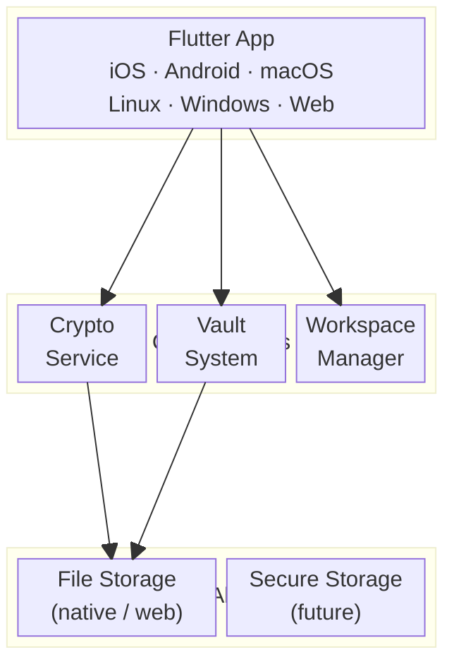
```mermaid
block-beta
    columns 3

    block:clients["Client Application"]:3
        app["Flutter App\niOS · Android · macOS\nLinux · Windows · Web"]
    end

    space:3

    block:core["Core Libraries"]:3
        crypto["Crypto\nService"]
        vault["Vault\nSystem"]
        workspace["Workspace\nManager"]
    end

    space:3

    block:platform["Platform Abstraction"]:3
        storage["File Storage\n(native / web)"]
        keychain["Secure Storage\n(future)"]
    end

    app --> crypto
    app --> vault
    app --> workspace
    crypto --> storage
    vault --> storage
```

### Layer Responsibilities

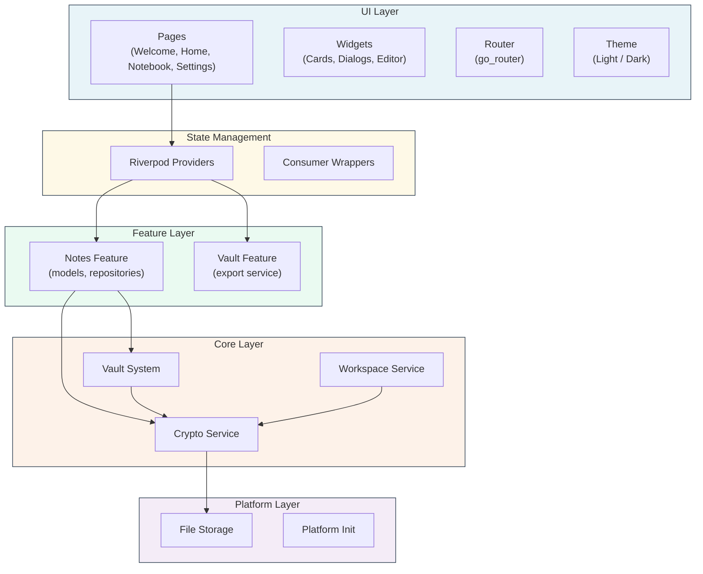
```mermaid
graph TD
    subgraph UI["UI Layer"]
        pages["Pages\n(Welcome, Home, Notebook, Settings)"]
        widgets["Widgets\n(Cards, Dialogs, Editor)"]
        router["Router\n(go_router)"]
        theme["Theme\n(Light / Dark)"]
    end

    subgraph State["State Management"]
        providers["Riverpod Providers"]
        consumers["Consumer Wrappers"]
    end

    subgraph Features["Feature Layer"]
        notes["Notes Feature\n(models, repositories)"]
        vaultFeature["Vault Feature\n(export service)"]
    end

    subgraph Core["Core Layer"]
        cryptoCore["Crypto Service"]
        vaultCore["Vault System"]
        workspaceCore["Workspace Service"]
    end

    subgraph Platform["Platform Layer"]
        storageP["File Storage"]
        platformInit["Platform Init"]
    end

    pages --> providers
    providers --> notes
    providers --> vaultFeature
    notes --> cryptoCore
    notes --> vaultCore
    vaultCore --> cryptoCore
    workspaceCore --> cryptoCore
    cryptoCore --> storageP

    style UI fill:#e8f4f8,stroke:#2c3e50
    style State fill:#fef9e7,stroke:#2c3e50
    style Features fill:#eafaf1,stroke:#2c3e50
    style Core fill:#fdf2e9,stroke:#2c3e50
    style Platform fill:#f4ecf7,stroke:#2c3e50
```

---

## 3. Data Hierarchy

Witflo organizes data in a strict hierarchy. Each level provides isolation and independent encryption boundaries.

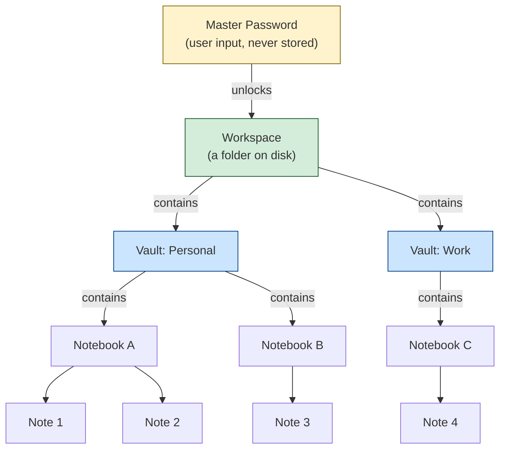
```mermaid
graph TD
    MP["Master Password\n(user input, never stored)"]
    WS["Workspace\n(a folder on disk)"]
    V1["Vault: Personal"]
    V2["Vault: Work"]
    NB1["Notebook A"]
    NB2["Notebook B"]
    NB3["Notebook C"]
    N1["Note 1"]
    N2["Note 2"]
    N3["Note 3"]
    N4["Note 4"]

    MP -->|"unlocks"| WS
    WS -->|"contains"| V1
    WS -->|"contains"| V2
    V1 -->|"contains"| NB1
    V1 -->|"contains"| NB2
    V2 -->|"contains"| NB3
    NB1 --> N1
    NB1 --> N2
    NB2 --> N3
    NB3 --> N4

    style MP fill:#fff3cd,stroke:#856404
    style WS fill:#d4edda,stroke:#155724
    style V1 fill:#cce5ff,stroke:#004085
    style V2 fill:#cce5ff,stroke:#004085
```

| Level | Encryption Boundary | Description |
|-------|---------------------|-------------|
| **Workspace** | Master Password → MUK → Keyring | A folder on disk containing one or more vaults |
| **Vault** | Independent random VaultKey | Isolated encrypted container with its own key |
| **Notebook** | Organizational only | Grouping within a vault |
| **Note** | HKDF-derived per-note ContentKey | Individual encrypted document |

---

## 4. Key Hierarchy & Cryptographic Architecture

### Key Derivation Flow

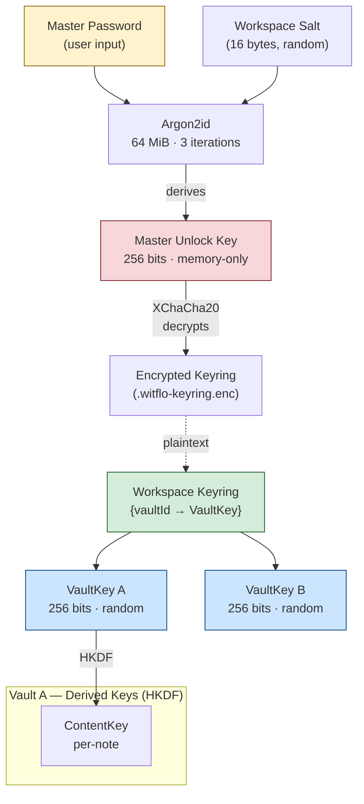
```mermaid
flowchart TD
    PASSWORD["Master Password\n(user input)"]
    SALT["Workspace Salt\n(16 bytes, random)"]
    ARGON["Argon2id\n64 MiB · 3 iterations"]
    MUK["Master Unlock Key\n256 bits · memory-only"]
    KEYRING_ENC["Encrypted Keyring\n(.witflo-keyring.enc)"]
    KEYRING["Workspace Keyring\n{vaultId → VaultKey}"]
    VK1["VaultKey A\n256 bits · random"]
    VK2["VaultKey B\n256 bits · random"]

    PASSWORD --> ARGON
    SALT --> ARGON
    ARGON -->|"derives"| MUK
    MUK -->|"XChaCha20\ndecrypts"| KEYRING_ENC
    KEYRING_ENC -.->|"plaintext"| KEYRING
    KEYRING --> VK1
    KEYRING --> VK2

    subgraph derived_a["Vault A — Derived Keys (HKDF)"]
        CK_A["ContentKey\nper-note"]
    end

    VK1 -->|"HKDF"| CK_A

    style PASSWORD fill:#fff3cd,stroke:#856404
    style MUK fill:#f8d7da,stroke:#721c24
    style VK1 fill:#cce5ff,stroke:#004085
    style VK2 fill:#cce5ff,stroke:#004085
    style KEYRING fill:#d4edda,stroke:#155724
```

### HKDF Context Strings

| Key | HKDF Context | Purpose |
|-----|-------------|---------|
| ContentKey | `witflo.content.{noteId}.v2` | Encrypts individual note content |

### Cryptographic Primitives

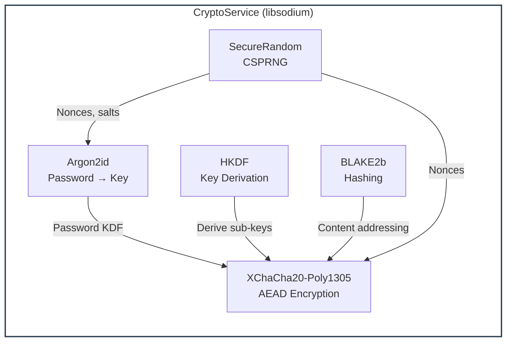
```mermaid
graph LR
    subgraph CryptoService["CryptoService (libsodium)"]
        A2["Argon2id\nPassword → Key"]
        XC["XChaCha20-Poly1305\nAEAD Encryption"]
        HK["HKDF\nKey Derivation"]
        B3["BLAKE2b\nHashing"]
        RNG["SecureRandom\nCSPRNG"]
    end

    A2 -->|"Password KDF"| XC
    HK -->|"Derive sub-keys"| XC
    B3 -->|"Content addressing"| XC
    RNG -->|"Nonces, salts"| A2
    RNG -->|"Nonces"| XC

    style CryptoService fill:#fff,stroke:#2c3e50,stroke-width:2px
```

### Encryption Format (XChaCha20-Poly1305)

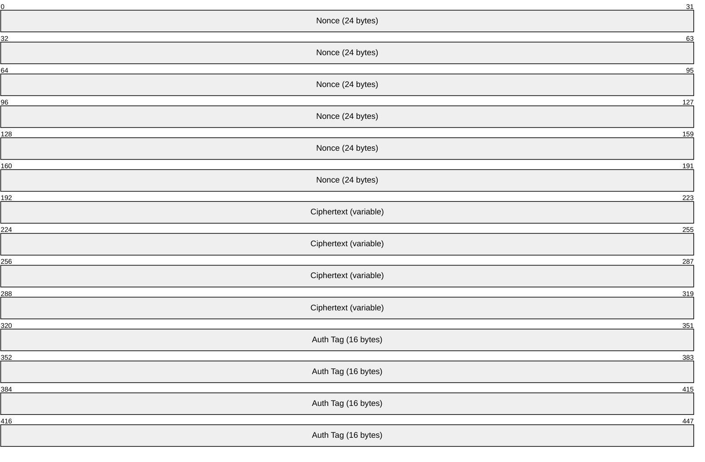
```mermaid
packet-beta
    0-191: "Nonce (24 bytes)"
    192-319: "Ciphertext (variable)"
    320-447: "Auth Tag (16 bytes)"
```

- **192-bit nonce**: safe for random generation (no collision risk)
- **AEAD**: authentication is built-in — tampering is detected
- **No AES-NI dependency**: fast on ARM/mobile without hardware acceleration

---

## 5. Workspace & Vault System

### Workspace Structure

A workspace is a folder on disk. One master password unlocks all vaults within it.

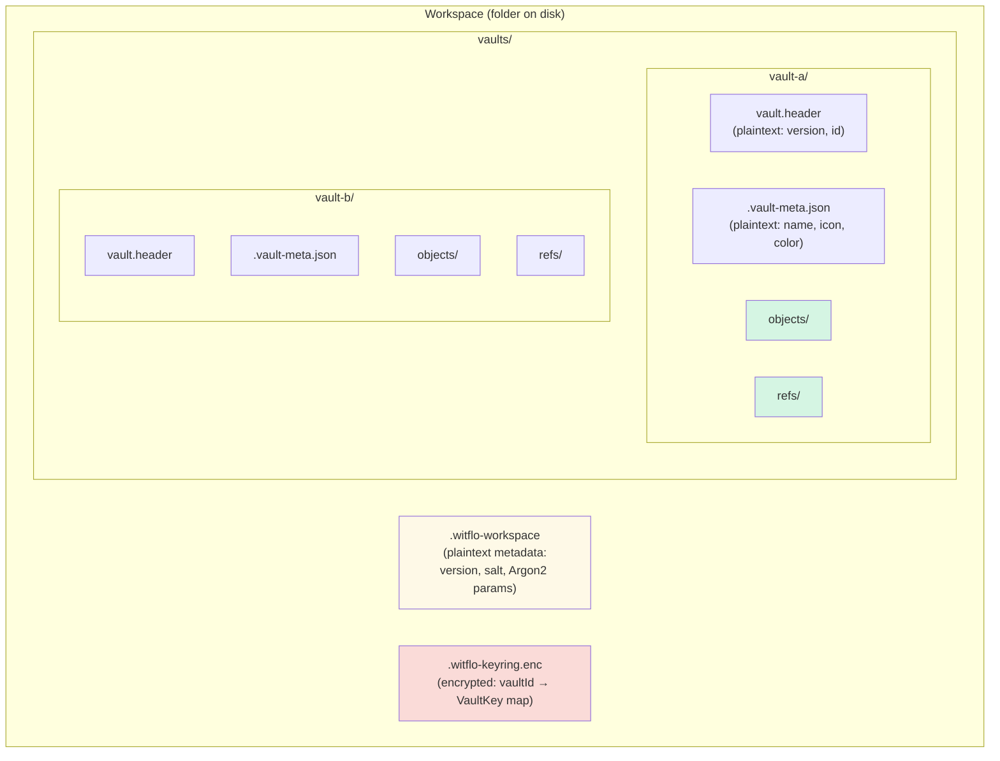
```mermaid
graph TD
    subgraph WS["Workspace (folder on disk)"]
        META[".witflo-workspace\n(plaintext metadata:\nversion, salt, Argon2 params)"]
        KEYRING[".witflo-keyring.enc\n(encrypted: vaultId → VaultKey map)"]

        subgraph vaults["vaults/"]
            subgraph va["vault-a/"]
                VA_H["vault.header\n(plaintext: version, id)"]
                VA_M[".vault-meta.json\n(plaintext: name, icon, color)"]
                VA_O["objects/"]
                VA_R["refs/"]
            end
            subgraph vb["vault-b/"]
                VB_H["vault.header"]
                VB_M[".vault-meta.json"]
                VB_O["objects/"]
                VB_R["refs/"]
            end
        end
    end

    style META fill:#fef9e7
    style KEYRING fill:#fadbd8
    style VA_O fill:#d5f5e3
    style VA_R fill:#d5f5e3
```

### Workspace Lifecycle

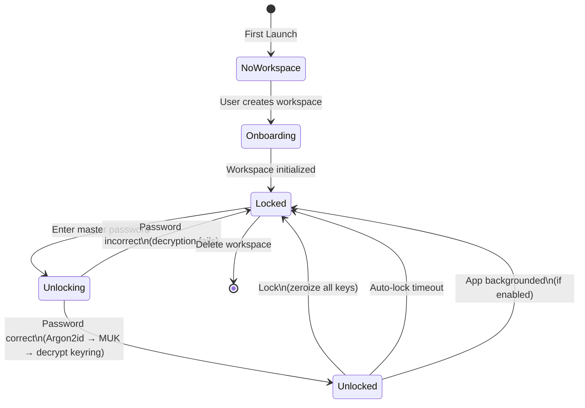
```mermaid
stateDiagram-v2
    [*] --> NoWorkspace: First Launch

    NoWorkspace --> Onboarding: User creates workspace
    Onboarding --> Locked: Workspace initialized

    Locked --> Unlocking: Enter master password
    Unlocking --> Unlocked: Password correct\n(Argon2id → MUK → decrypt keyring)
    Unlocking --> Locked: Password incorrect\n(decryption fails)

    Unlocked --> Locked: Lock\n(zeroize all keys)
    Unlocked --> Locked: Auto-lock timeout
    Unlocked --> Locked: App backgrounded\n(if enabled)

    Locked --> [*]: Delete workspace
```

### Vault Creation Flow

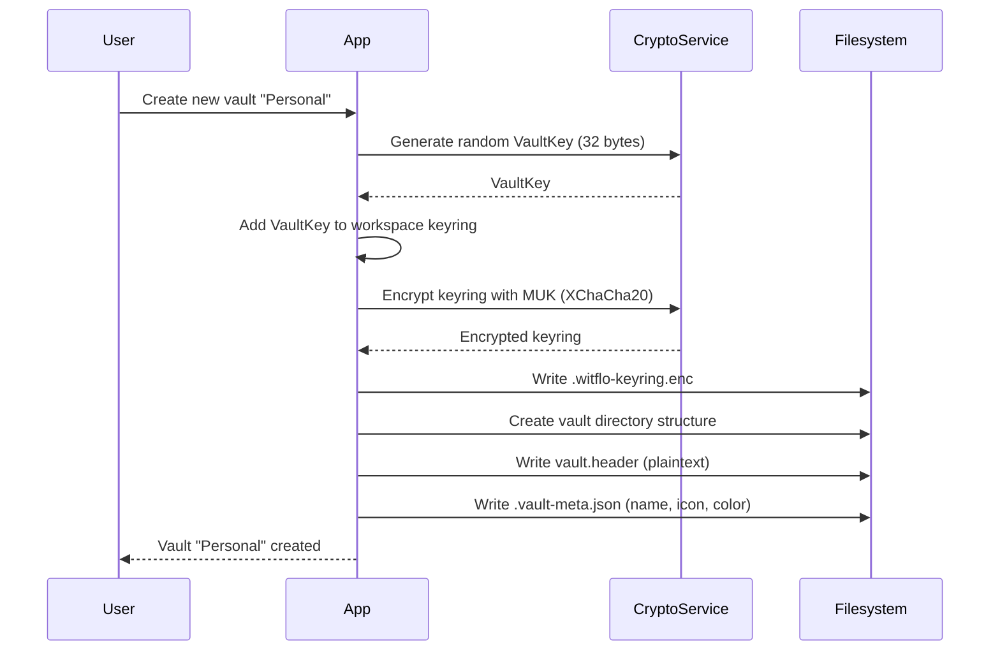
```mermaid
sequenceDiagram
    participant User
    participant App
    participant Crypto as CryptoService
    participant FS as Filesystem

    User->>App: Create new vault "Personal"
    App->>Crypto: Generate random VaultKey (32 bytes)
    Crypto-->>App: VaultKey

    App->>App: Add VaultKey to workspace keyring
    App->>Crypto: Encrypt keyring with MUK (XChaCha20)
    Crypto-->>App: Encrypted keyring

    App->>FS: Write .witflo-keyring.enc
    App->>FS: Create vault directory structure
    App->>FS: Write vault.header (plaintext)
    App->>FS: Write .vault-meta.json (name, icon, color)

    App-->>User: Vault "Personal" created
```

---

## 6. Encrypted Storage Layout

### Content-Addressed Object Store

All storage is file-based. Notes are stored as encrypted blobs in a content-addressed layout. The filename is derived from a BLAKE2b hash.

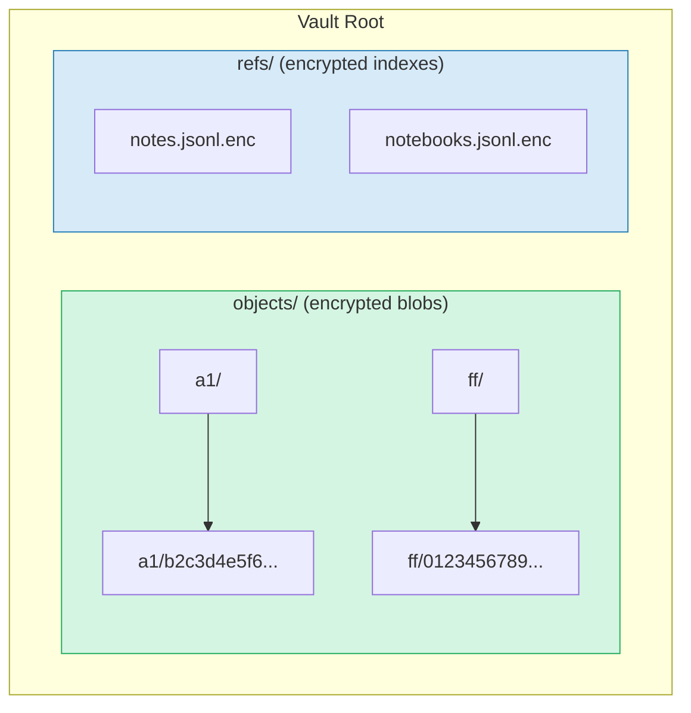
```mermaid
graph TD
    subgraph vault_root["Vault Root"]
        subgraph objects["objects/ (encrypted blobs)"]
            dir_a1["a1/"]
            dir_ff["ff/"]
            blob1["a1/b2c3d4e5f6..."]
            blob2["ff/0123456789..."]
            dir_a1 --> blob1
            dir_ff --> blob2
        end

        subgraph refs["refs/ (encrypted indexes)"]
            notes_idx["notes.jsonl.enc"]
            nb_idx["notebooks.jsonl.enc"]
        end
    end

    style objects fill:#d5f5e3,stroke:#27ae60
    style refs fill:#d6eaf8,stroke:#2980b9
```

### Note Save Flow

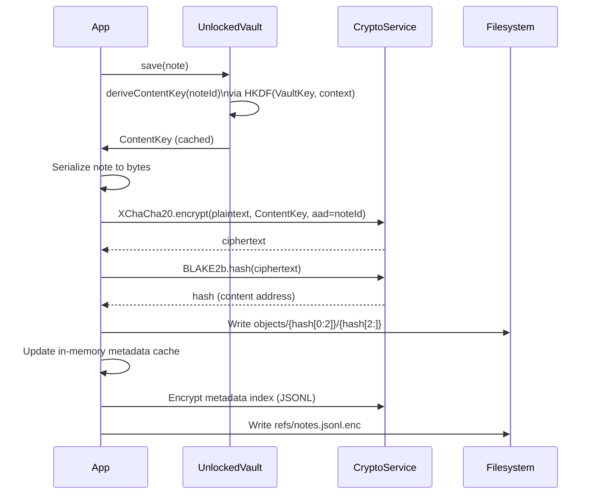
```mermaid
sequenceDiagram
    participant App
    participant Vault as UnlockedVault
    participant Crypto as CryptoService
    participant FS as Filesystem

    App->>Vault: save(note)
    Vault->>Vault: deriveContentKey(noteId)\nvia HKDF(VaultKey, context)
    Vault->>App: ContentKey (cached)

    App->>App: Serialize note to bytes
    App->>Crypto: XChaCha20.encrypt(plaintext, ContentKey, aad=noteId)
    Crypto-->>App: ciphertext

    App->>Crypto: BLAKE2b.hash(ciphertext)
    Crypto-->>App: hash (content address)

    App->>FS: Write objects/{hash[0:2]}/{hash[2:]}
    App->>App: Update in-memory metadata cache
    App->>Crypto: Encrypt metadata index (JSONL)
    App->>FS: Write refs/notes.jsonl.enc
```

---

## 7. Application Lifecycle

### Startup & Initialization

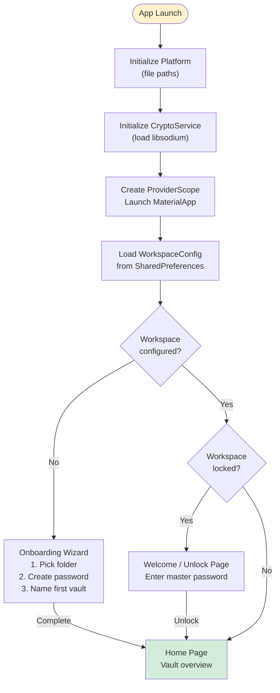
```mermaid
flowchart TD
    START(["App Launch"]) --> INIT_PLATFORM["Initialize Platform\n(file paths)"]
    INIT_PLATFORM --> INIT_CRYPTO["Initialize CryptoService\n(load libsodium)"]
    INIT_CRYPTO --> INIT_APP["Create ProviderScope\nLaunch MaterialApp"]
    INIT_APP --> LOAD_CONFIG["Load WorkspaceConfig\nfrom SharedPreferences"]

    LOAD_CONFIG --> HAS_WS{Workspace\nconfigured?}
    HAS_WS -->|"No"| ONBOARDING["Onboarding Wizard\n1. Pick folder\n2. Create password\n3. Name first vault"]
    HAS_WS -->|"Yes"| IS_LOCKED{Workspace\nlocked?}

    IS_LOCKED -->|"Yes"| WELCOME["Welcome / Unlock Page\nEnter master password"]
    IS_LOCKED -->|"No"| HOME["Home Page\nVault overview"]

    ONBOARDING -->|"Complete"| HOME
    WELCOME -->|"Unlock"| HOME

    style START fill:#fff3cd
    style HOME fill:#d4edda
```

### Unlock Sequence

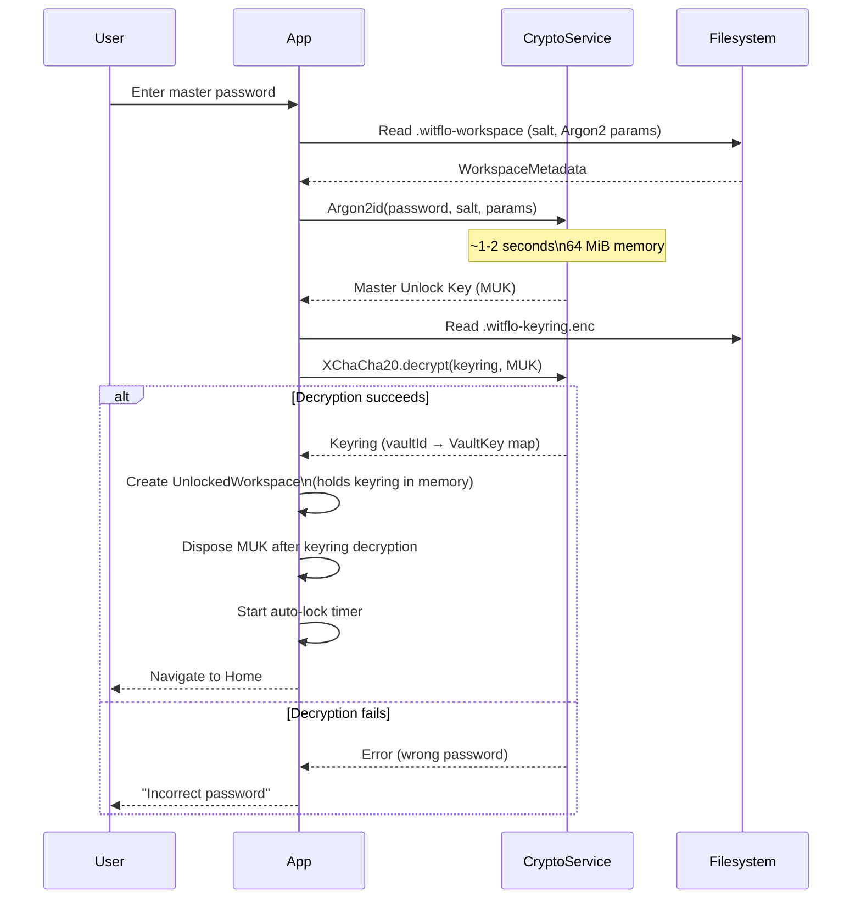
```mermaid
sequenceDiagram
    participant User
    participant App
    participant Crypto as CryptoService
    participant FS as Filesystem

    User->>App: Enter master password
    App->>FS: Read .witflo-workspace (salt, Argon2 params)
    FS-->>App: WorkspaceMetadata

    App->>Crypto: Argon2id(password, salt, params)
    Note over Crypto: ~1-2 seconds\n64 MiB memory
    Crypto-->>App: Master Unlock Key (MUK)

    App->>FS: Read .witflo-keyring.enc
    App->>Crypto: XChaCha20.decrypt(keyring, MUK)

    alt Decryption succeeds
        Crypto-->>App: Keyring (vaultId → VaultKey map)
        App->>App: Create UnlockedWorkspace\n(holds keyring in memory)
        App->>App: Dispose MUK after keyring decryption
        App->>App: Start auto-lock timer
        App-->>User: Navigate to Home
    else Decryption fails
        Crypto-->>App: Error (wrong password)
        App-->>User: "Incorrect password"
    end
```

### Auto-Lock Behavior

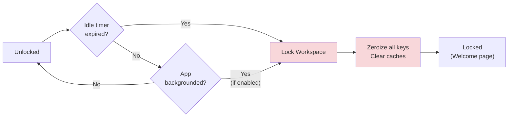
```mermaid
flowchart LR
    UNLOCKED["Unlocked"] --> IDLE{"Idle timer\nexpired?"}
    IDLE -->|"Yes"| LOCK["Lock Workspace"]
    IDLE -->|"No"| BG{"App\nbackgrounded?"}
    BG -->|"Yes\n(if enabled)"| LOCK
    BG -->|"No"| UNLOCKED

    LOCK --> ZEROIZE["Zeroize all keys\nClear caches"]
    ZEROIZE --> LOCKED["Locked\n(Welcome page)"]

    style LOCK fill:#f8d7da
    style ZEROIZE fill:#f8d7da
```

---

## 8. State Management

### Provider Architecture

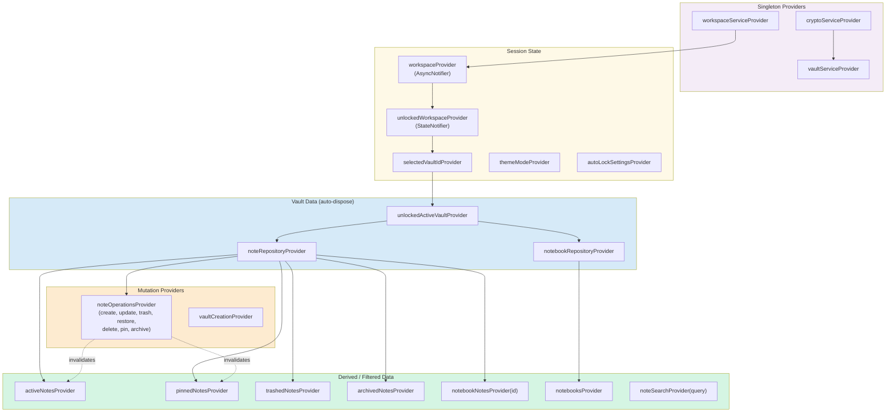
```mermaid
flowchart TD
    subgraph singletons["Singleton Providers"]
        CRYPTO["cryptoServiceProvider"]
        WS_SVC["workspaceServiceProvider"]
        VAULT_SVC["vaultServiceProvider"]
    end

    subgraph session["Session State"]
        WS["workspaceProvider\n(AsyncNotifier)"]
        UNLOCKED["unlockedWorkspaceProvider\n(StateNotifier)"]
        SELECTED["selectedVaultIdProvider"]
        THEME["themeModeProvider"]
        AUTOLOCK["autoLockSettingsProvider"]
    end

    subgraph vault_data["Vault Data (auto-dispose)"]
        ACTIVE_VAULT["unlockedActiveVaultProvider"]
        NOTE_REPO["noteRepositoryProvider"]
        NB_REPO["notebookRepositoryProvider"]
    end

    subgraph derived["Derived / Filtered Data"]
        ACTIVE_NOTES["activeNotesProvider"]
        PINNED["pinnedNotesProvider"]
        TRASHED["trashedNotesProvider"]
        ARCHIVED["archivedNotesProvider"]
        NB_NOTES["notebookNotesProvider(id)"]
        NOTEBOOKS["notebooksProvider"]
        SEARCH["noteSearchProvider(query)"]
    end

    subgraph mutations["Mutation Providers"]
        NOTE_OPS["noteOperationsProvider\n(create, update, trash, restore,\ndelete, pin, archive)"]
        VAULT_CREATE["vaultCreationProvider"]
    end

    CRYPTO --> VAULT_SVC
    WS_SVC --> WS
    WS --> UNLOCKED
    UNLOCKED --> SELECTED
    SELECTED --> ACTIVE_VAULT
    ACTIVE_VAULT --> NOTE_REPO
    ACTIVE_VAULT --> NB_REPO
    NOTE_REPO --> ACTIVE_NOTES
    NOTE_REPO --> PINNED
    NOTE_REPO --> TRASHED
    NOTE_REPO --> ARCHIVED
    NOTE_REPO --> NB_NOTES
    NB_REPO --> NOTEBOOKS
    NOTE_REPO --> NOTE_OPS
    NOTE_OPS -.->|"invalidates"| ACTIVE_NOTES
    NOTE_OPS -.->|"invalidates"| PINNED

    style singletons fill:#f4ecf7
    style session fill:#fef9e7
    style vault_data fill:#d6eaf8
    style derived fill:#d5f5e3
    style mutations fill:#fdebd0
```

### State Invalidation Pattern

After any mutation (create, update, delete), the operation provider invalidates all affected downstream providers, triggering automatic UI rebuilds via Riverpod's reactive graph.

---

## 9. UI Architecture

### Navigation & Routing

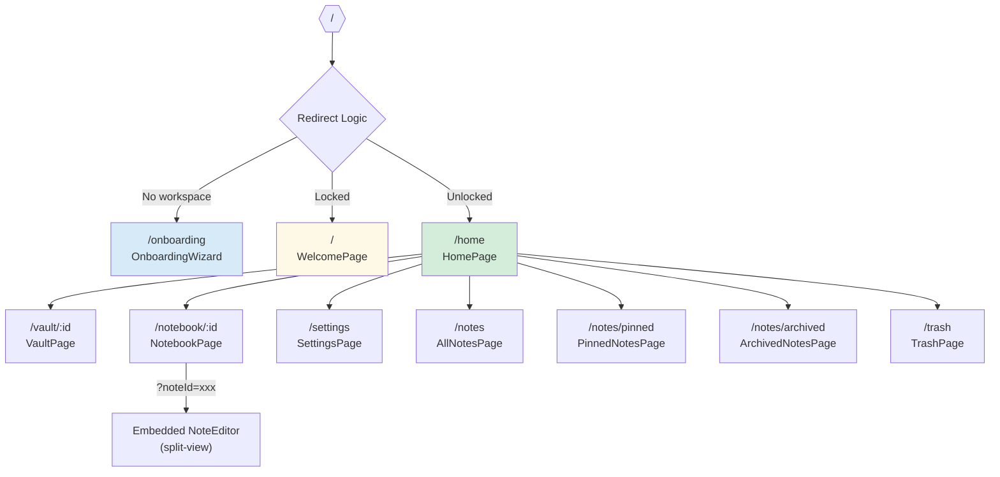
```mermaid
flowchart TD
    ROOT{{"/"}} --> REDIRECT{"Redirect Logic"}

    REDIRECT -->|"No workspace"| ONBOARDING["/onboarding\nOnboardingWizard"]
    REDIRECT -->|"Locked"| WELCOME["/\nWelcomePage"]
    REDIRECT -->|"Unlocked"| HOME["/home\nHomePage"]

    HOME --> VAULT["/vault/:id\nVaultPage"]
    HOME --> NOTEBOOK["/notebook/:id\nNotebookPage"]
    HOME --> SETTINGS["/settings\nSettingsPage"]
    HOME --> ALL_NOTES["/notes\nAllNotesPage"]
    HOME --> PINNED_NOTES["/notes/pinned\nPinnedNotesPage"]
    HOME --> ARCHIVED_NOTES["/notes/archived\nArchivedNotesPage"]
    HOME --> TRASH["/trash\nTrashPage"]

    NOTEBOOK -->|"?noteId=xxx"| NOTE_EDITOR["Embedded NoteEditor\n(split-view)"]

    style WELCOME fill:#fef9e7
    style HOME fill:#d4edda
    style ONBOARDING fill:#d6eaf8
```

### Page Layout Strategy

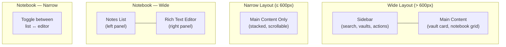
```mermaid
graph TD
    subgraph wide["Wide Layout (> 600px)"]
        W_SIDEBAR["Sidebar\n(search, vaults, actions)"]
        W_MAIN["Main Content\n(vault card, notebook grid)"]
        W_SIDEBAR --- W_MAIN
    end

    subgraph narrow["Narrow Layout (≤ 600px)"]
        N_MAIN["Main Content Only\n(stacked, scrollable)"]
    end

    subgraph notebook_wide["Notebook — Wide"]
        NW_LIST["Notes List\n(left panel)"]
        NW_EDITOR["Rich Text Editor\n(right panel)"]
        NW_LIST --- NW_EDITOR
    end

    subgraph notebook_narrow["Notebook — Narrow"]
        NN_TOGGLE["Toggle between\nlist ↔ editor"]
    end
```

### Theme System

| Property | Light | Dark |
|----------|-------|------|
| Background | Warm cream `#FFFBF5` | Warm dark `#1C1915` |
| Surface | Paper white `#FFF9F0` | Dark surface `#272218` |
| Text | Charcoal `#3D3226` | Warm light `#F5F0E8` |
| Font | Nunito (Google Fonts) | Nunito (Google Fonts) |
| Border radius | `0.0` (sharp edges) | `0.0` (sharp edges) |
| Design language | Paper notebook aesthetic | Paper notebook aesthetic |

---

## 10. Platform Abstraction

### Platform Support Matrix

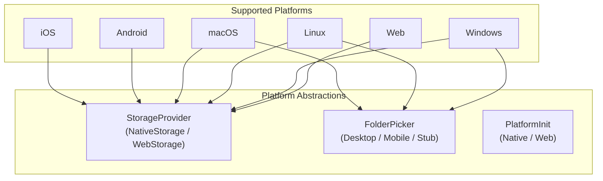
```mermaid
graph TD
    subgraph platforms["Supported Platforms"]
        IOS["iOS"]
        ANDROID["Android"]
        MACOS["macOS"]
        LINUX["Linux"]
        WINDOWS["Windows"]
        WEB["Web"]
    end

    subgraph abstractions["Platform Abstractions"]
        STORAGE["StorageProvider\n(NativeStorage / WebStorage)"]
        PICKER["FolderPicker\n(Desktop / Mobile / Stub)"]
        INIT["PlatformInit\n(Native / Web)"]
    end

    IOS --> STORAGE
    ANDROID --> STORAGE
    MACOS --> STORAGE
    LINUX --> STORAGE
    WINDOWS --> STORAGE
    WEB --> STORAGE

    MACOS --> PICKER
    LINUX --> PICKER
    WINDOWS --> PICKER
```

### Conditional Import Pattern

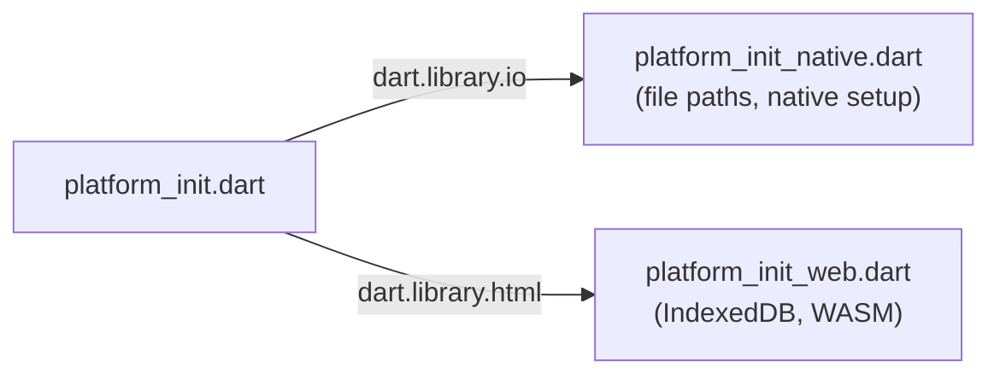
```mermaid
flowchart LR
    IMPORT["platform_init.dart"] -->|"dart.library.io"| NATIVE["platform_init_native.dart\n(file paths, native setup)"]
    IMPORT -->|"dart.library.html"| WEBINIT["platform_init_web.dart\n(IndexedDB, WASM)"]
```

---

## 11. Threat Model

### What Witflo Protects Against

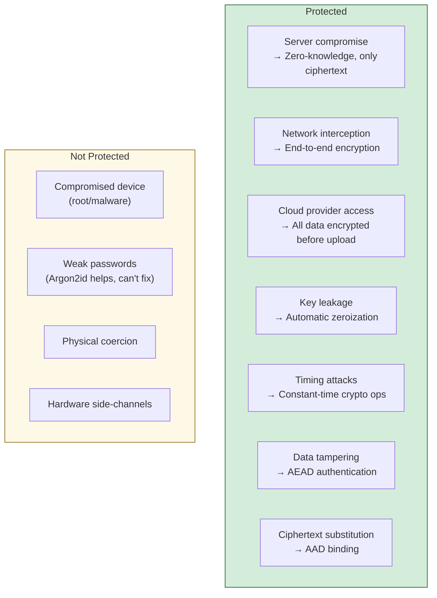
```mermaid
graph TD
    subgraph protected["Protected"]
        T1["Server compromise\n→ Zero-knowledge, only ciphertext"]
        T2["Network interception\n→ End-to-end encryption"]
        T3["Cloud provider access\n→ All data encrypted before upload"]
        T4["Key leakage\n→ Automatic zeroization"]
        T5["Timing attacks\n→ Constant-time crypto ops"]
        T6["Data tampering\n→ AEAD authentication"]
        T7["Ciphertext substitution\n→ AAD binding"]
    end

    subgraph not_protected["Not Protected"]
        T8["Compromised device\n(root/malware)"]
        T9["Weak passwords\n(Argon2id helps, can't fix)"]
        T10["Physical coercion"]
        T11["Hardware side-channels"]
    end

    style protected fill:#d4edda,stroke:#155724
    style not_protected fill:#fef9e7,stroke:#856404
```

### Key Security Invariants

1. **Password is NEVER stored** — not even as a hash
2. **MUK is NEVER persisted** — exists only in memory during unlock
3. **Vault Keys are always encrypted at rest** — with MUK
4. **All derived keys are disposed when workspace locks** — memory zeroized
5. **Keys are type-safe** — `ContentKey` cannot be used where `VaultKey` is expected
6. **Every encryption uses fresh random nonces** — via libsodium CSPRNG

---

*Built with the belief that privacy is a fundamental right, not a feature.*
