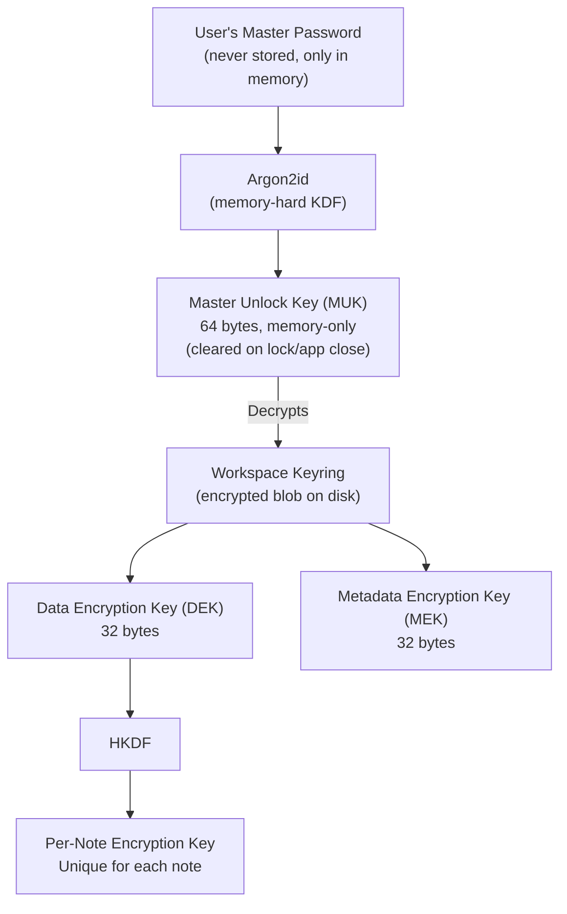

# Encryption

Deep dive into Witflo's encryption implementation.

## Overview

Witflo uses **industry-standard cryptographic primitives** via [libsodium](https://libsodium.gitbook.io/), a well-audited cryptographic library.

**Key principles**:
- Zero-trust: Server never sees plaintext
- Client-side only: All crypto happens on your device
- Authenticated encryption: Prevents tampering
- Key isolation: Each note has unique encryption keys

## Cryptographic Stack

| Component | Algorithm | Purpose |
|-----------|-----------|---------|
| Password hashing | Argon2id | Derive key from password |
| Key derivation | HKDF | Derive per-note keys |
| Encryption | XChaCha20-Poly1305 | Encrypt note content |
| Random generation | libsodium RNG | Generate salts, nonces |

All algorithms are **NIST-approved** or **well-studied** by the cryptographic community.

## Key Hierarchy



## Detailed Algorithms

### 1. Password to Master Unlock Key

**Algorithm**: Argon2id  
**Parameters**:
- Memory: 64 MiB
- Iterations: 4
- Parallelism: 2
- Output: 64 bytes

```dart
Uint8List deriveKeyFromPassword(String password, Uint8List salt) {
  return sodium.crypto_pwhash(
    outLen: 64,
    password: password.codeUnits,
    salt: salt, // 16 bytes random
    opsLimit: crypto_pwhash_OPSLIMIT_INTERACTIVE,
    memLimit: crypto_pwhash_MEMLIMIT_INTERACTIVE,
    alg: crypto_pwhash_ALG_ARGON2ID13,
  );
}
```

**Why Argon2id?**
- Memory-hard: Makes GPU/ASIC attacks expensive
- Resistant to side-channel attacks
- Winner of Password Hashing Competition (2015)
- OWASP recommended

### 2. Keyring Encryption

The workspace keyring contains the DEK and MEK. It's encrypted with the Master Unlock Key.

**Algorithm**: XChaCha20-Poly1305  
**Key**: First 32 bytes of MUK  
**Nonce**: 24 bytes (random, stored with ciphertext)

```dart
Uint8List encryptKeyring(Keyring keyring, Uint8List muk) {
  final nonce = randomBytes(24);
  final key = muk.sublist(0, 32); // First 32 bytes of MUK
  
  final ciphertext = sodium.crypto_aead_xchacha20poly1305_ietf_encrypt(
    message: keyring.serialize(),
    additionalData: null,
    nonce: nonce,
    key: key,
  );
  
  return nonce + ciphertext; // Store nonce with ciphertext
}
```

### 3. Per-Note Key Derivation

Each note gets a unique encryption key derived from the DEK.

**Algorithm**: HKDF-SHA256  
**Input Key Material (IKM)**: DEK (32 bytes)  
**Salt**: Workspace ID  
**Info**: Note ID + context string  
**Output**: 32 bytes

```dart
Uint8List deriveNoteKey(Uint8List dek, String noteId, String workspaceId) {
  return hkdf(
    ikm: dek,
    salt: utf8.encode(workspaceId),
    info: utf8.encode('witflo.note.$noteId'),
    length: 32,
  );
}
```

**Why per-note keys?**
- Limits damage if one key is compromised
- Enables secure key rotation
- No key reuse across different data

### 4. Note Content Encryption

**Algorithm**: XChaCha20-Poly1305 (AEAD)  
**Key**: Derived note key (32 bytes)  
**Nonce**: 24 bytes (random, stored with ciphertext)  
**Additional Data**: Note metadata (authenticated but not encrypted)

```dart
Uint8List encryptNote(
  String plaintext,
  Uint8List noteKey,
  String noteMetadata,
) {
  final nonce = randomBytes(24);
  
  final ciphertext = sodium.crypto_aead_xchacha20poly1305_ietf_encrypt(
    message: utf8.encode(plaintext),
    additionalData: utf8.encode(noteMetadata),
    nonce: nonce,
    key: noteKey,
  );
  
  return nonce + ciphertext;
}
```

**Why XChaCha20-Poly1305?**
- **Authenticated** encryption (prevents tampering)
- **Fast** on all platforms (no hardware requirement)
- **Safe** nonce generation (192-bit nonce, collision-resistant)
- **Modern** and well-studied

### 5. Metadata Encryption

Note metadata (title, timestamps, tags) is encrypted with MEK.

**Algorithm**: XChaCha20-Poly1305  
**Key**: MEK from keyring  
**Nonce**: 24 bytes random

This allows:
- Searching encrypted metadata
- Listing notes without decrypting content
- Metadata integrity verification

## Security Properties

### Confidentiality

✅ **Semantic security**: Identical plaintexts produce different ciphertexts  
✅ **Forward secrecy**: Compromising one key doesn't compromise others  
✅ **No key reuse**: Each note has unique keys

### Integrity

✅ **Authentication**: Poly1305 MAC prevents tampering  
✅ **Additional data**: Metadata authenticated but not encrypted  
✅ **Nonce uniqueness**: Random 192-bit nonces (collision-resistant)

### Availability

✅ **Offline**: All operations work without network  
✅ **No key escrow**: No backdoor or recovery mechanism  
✅ **Deterministic**: Same password always produces same key

## Threat Model

### What Witflo Protects Against

✅ **Server compromise**: Server only sees ciphertext  
✅ **Network interception**: All data encrypted before transmission  
✅ **Disk theft**: Encrypted files useless without password  
✅ **Memory dumps** (partially): Keys cleared on lock  
✅ **Brute force**: Argon2id makes password guessing expensive

### What Witflo Does NOT Protect Against

❌ **Keyloggers**: If password is captured during entry  
❌ **Screen recording**: Plaintext visible while unlocked  
❌ **Memory forensics** (advanced): While unlocked, keys are in RAM  
❌ **Weak passwords**: We can't force strong passwords  
❌ **Malware on device**: If device is compromised, all bets are off  
❌ **Rubber-hose cryptanalysis**: Physical coercion

### Trust Assumptions

You must trust:
- **Your device** is not compromised
- **libsodium** implementation is correct
- **Flutter/Dart runtime** is not backdoored
- **Your password** is strong and secret

You do **NOT** need to trust:
- The server (if using sync)
- Network infrastructure
- Witflo developers (code is open source)

## Implementation Details

### Random Number Generation

```dart
Uint8List randomBytes(int length) {
  return sodium.randombytes_buf(length);
}
```

Uses libsodium's CSPRNG (Cryptographically Secure Pseudo-Random Number Generator):
- Linux/macOS: `/dev/urandom`
- Windows: `BCryptGenRandom`
- Web: `crypto.getRandomValues()`

### Memory Zeroization

```dart
void zeroize(Uint8List buffer) {
  sodium.sodium_memzero(buffer);
}
```

Overwrites memory with zeros to prevent:
- Memory dumps
- Swap file leakage
- Cold boot attacks

**Limitations**: Cannot guarantee compiler optimizations don't keep copies.

### Constant-Time Comparison

For secret comparison (e.g., password verification):

```dart
bool constantTimeEqual(Uint8List a, Uint8List b) {
  if (a.length != b.length) return false;
  return sodium.sodium_memcmp(a, b) == 0;
}
```

Prevents timing attacks that could leak information about secrets.

## Key Rotation

### Changing Master Password

1. User enters old password → unlock workspace
2. User enters new password
3. Derive new MUK from new password
4. Re-encrypt keyring with new MUK
5. Zeroize old MUK

**Note**: Individual note keys don't change (derived from DEK, which is unchanged).

### Rotating DEK

For complete key rotation (e.g., after suspected compromise):

1. Generate new DEK
2. Derive new keys for all notes
3. Re-encrypt all notes with new keys
4. Re-encrypt keyring with new DEK

**Warning**: This is expensive for large workspaces.

## Compliance & Standards

| Standard | Status |
|----------|--------|
| FIPS 140-2/3 | Algorithms approved, but libsodium not FIPS-certified |
| NIST | Algorithms recommended by NIST |
| OWASP | Follows OWASP crypto guidelines |
| GDPR | Supports "encryption by design" |

## Future Enhancements

- [ ] Post-quantum cryptography (preparing for quantum computers)
- [ ] Hardware-backed key storage (TPM, Secure Enclave)
- [ ] Zero-knowledge sync protocol
- [ ] Shamir's Secret Sharing for key recovery

## References

- [libsodium Documentation](https://libsodium.gitbook.io/)
- [Argon2 RFC 9106](https://www.rfc-editor.org/rfc/rfc9106.html)
- [XChaCha20-Poly1305](https://tools.ietf.org/html/rfc8439)
- [HKDF RFC 5869](https://tools.ietf.org/html/rfc5869)
- [OWASP Cryptographic Storage](https://cheatsheetseries.owasp.org/cheatsheets/Cryptographic_Storage_Cheat_Sheet.html)

---

**Questions?** Open a [discussion on GitHub](https://github.com/nativewit/witflo/discussions).
